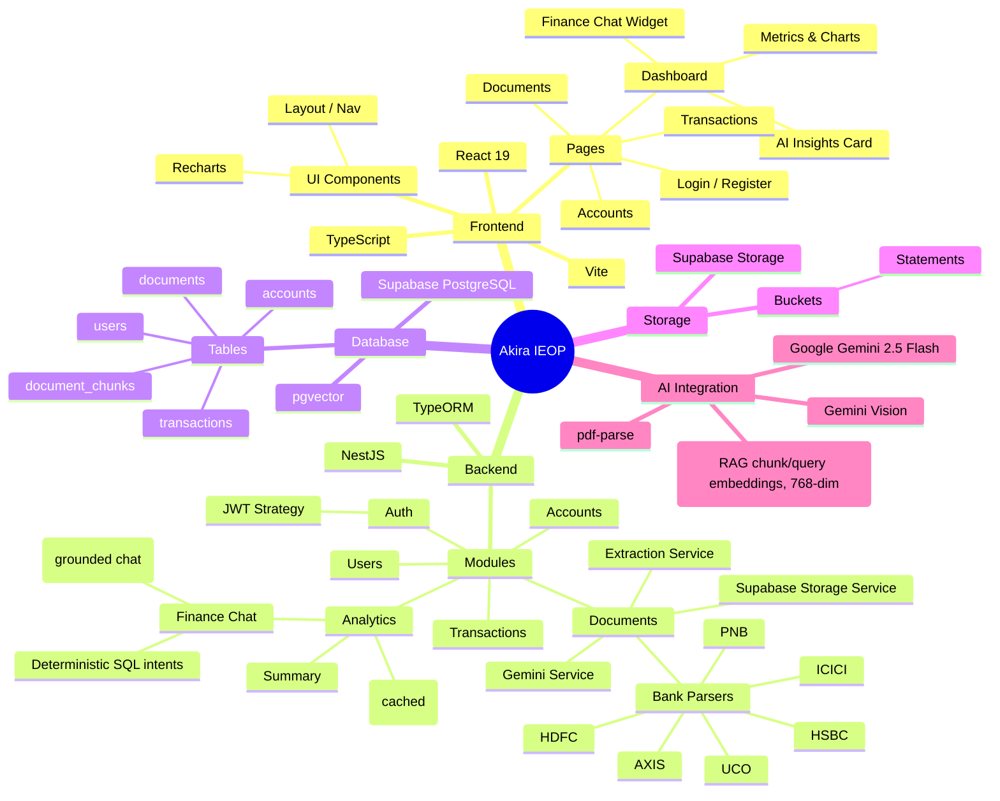

# Akira - Intelligent Enterprise Operations Platform (IEOP)
## Project Context & Architecture

This document provides a high-level overview of the Akira project, serving as a comprehensive mind map and architectural graph. It is designed to quickly onboard developers (and AI agents) by explaining the project's structure, components, and data flows.

---

## 🧠 Project Mind Map



---

## 🏗️ Architecture Graph

```mermaid
graph TD
    %% User and UI Layer
    Client[Browser / Frontend Client] -->|React Router| UI[React UI Components]
    UI --> API_Client[Frontend API Context / Axios]

    %% Backend Layer
    API_Client -->|REST API over HTTP| NestApp[Nest.js Backend Server]

    subgraph Backend [Nest.js application]
        NestApp --> AuthController[Auth Module]
        NestApp --> AccountsController[Accounts Module]
        NestApp --> DocumentsController[Documents Module]
        NestApp --> TransactionsController[Transactions Module]
        NestApp --> AnalyticsController[Analytics Module]
    end

    %% Data Processing & AI Layer
    DocumentsController -->|Upload Document| Storage[(Supabase Storage)]
    DocumentsController -->|Extract Text| Parser[pdf-parse / Text Extractor]
    Parser -->|Match bank format| BankParsers[Bank Statement Parsers\nHDFC / ICICI / HSBC / UCO / PNB / AXIS]
    DocumentsController -->|If Image/Scanned| GeminiVision[Gemini Vision]
    DocumentsController -->|Fallback/Enrichment| GeminiFlash[Gemini 2.5 Flash]
    BankParsers -->|Structured Transactions| TransactionsController
    GeminiFlash -->|Extract Structured JSON| TransactionsController

    %% Analytics / AI Chat Layer
    AnalyticsController -->|Aggregate SQL Metrics| DB[(Supabase PostgreSQL)]
    AnalyticsController -->|AI Insights| GeminiFlash
    AnalyticsController -->|Cache Insights| InsightsCache[(In-Memory AI Insights Cache)]
    AnalyticsController -->|/analytics/chat deterministic intents| GeminiFlash
    AnalyticsController -->|/analytics/chat intent=unknown| RagService[RAG Service]
    RagService -->|Embed question + cosine search| text_embed[gemini-embedding-001]
    RagService -->|Grounded generation + citations| GeminiFlash
    text_embed --> DB

    %% Database Layer
    AuthController --> DB
    AccountsController --> DB
    DocumentsController --> DB
    TransactionsController --> DB

    %% RAG indexing (on extraction, text-based documents only)
    DocumentsController -->|Chunk + Embed raw_text| text_embed
    text_embed -->|Store vector(768)| DB

    %% Styling
    classDef frontend fill:#61dafb,stroke:#333,stroke-width:2px,color:#000
    classDef backend fill:#ea2845,stroke:#333,stroke-width:2px,color:#fff
    classDef db fill:#3ecf8e,stroke:#333,stroke-width:2px,color:#000
    classDef ai fill:#4285f4,stroke:#333,stroke-width:2px,color:#fff

    class Client,UI,API_Client frontend
    class NestApp,AuthController,AccountsController,DocumentsController,TransactionsController,AnalyticsController,RagService backend
    class DB,Storage,InsightsCache db
    class GeminiVision,GeminiFlash,text_embed,BankParsers,Parser ai
```

---

## 📂 Codebase Structure Directory

### `/frontend`
- **Tech Stack**: React 19, Vite, TypeScript, React Router 7, Axios, Recharts.
- **Key Directories**:
  - `src/api`: Handles all HTTP requests to the backend (`client.ts` holds the shared Axios instance; one file per resource — `auth`, `accounts`, `documents`, `transactions`, `analytics`).
  - `src/assets`: Static assets, images, icons.
  - `src/components`: Reusable UI (currently `Layout` — the authenticated app shell/nav).
  - `src/context`: React Context providers for global state (`AuthContext` — JWT/session).
  - `src/pages`: Main application views — `LoginPage`, `RegisterPage`, `DashboardPage` (metrics, charts, AI insights, finance chat widget), `AccountsPage`, `DocumentsPage`, `ReviewPage` (per-document reconciliation + mandatory transaction review, reached from a completed document's "Review" action), `TransactionsPage`.

### `/backend`
- **Tech Stack**: Nest.js 11, TypeORM 0.3, TypeScript, Passport-JWT, `@google/generative-ai`, `@supabase/supabase-js`.
- **Key Directories**:
  - `src/auth`: Authentication logic — registration/login, `jwt.strategy.ts`, JWT generation and validation.
  - `src/users`: User management and lookups.
  - `src/accounts`: Bank account CRUD, scoped to the authenticated user.
  - `src/documents`: Document upload, Supabase storage, and the AI extraction pipeline:
    - `extraction.service.ts` — orchestrates the pipeline (download → decrypt → extract → save).
    - `gemini.service.ts` — Gemini Vision/Flash prompting for transaction extraction and finance-chat intent parsing.
    - `supabase-storage.service.ts` — upload/download/signed URLs against Supabase Storage.
    - `parsers/` — deterministic per-bank statement parsers (`hdfc`, `icici`, `hsbc`, `uco`, `pnb`, `axis`) behind a common `BankParser` interface, selected by `parser.factory.ts` before falling back to Gemini.
    - `chunking.util.ts` — hand-rolled line-aware text splitter (~800 chars, ~150 overlap) for Phase 3's RAG indexing.
    - `document-chunks.service.ts` — raw-SQL insert/cosine-similarity-search (`pgvector`'s `<=>` operator) over `document_chunks`, scoped to a user via a join to `documents`.
  - `src/transactions`: Manages parsed/manual transactions linked to accounts and documents.
  - `src/analytics`: Aggregated metrics (`analytics.service.ts`), AI insights with an in-memory TTL cache (`ai-insights-cache.service.ts`, invalidated on transaction changes), and the natural-language `financeChat` endpoint (`finance-chat.types.ts` / `finance-chat.dto.ts`). Both of its base query builders (`baseFilteredQuery`, `baseTxQuery`) gate on `tx.reviewed = true` — unconfirmed extracted transactions never reach any aggregate. `rag.service.ts` handles `financeChat`'s `unknown`-intent fallback — grounded Q&A over a user's own raw statement text (fine print, fees, terms), kept deliberately separate in code from the deterministic-SQL intents so the "LLM never states the number" guarantee there is unaffected.
  - `src/entities`: TypeORM entity definitions mapping to the PostgreSQL database (`User` w/ `UserRole` ADMIN/USER, `Account`, `Document` w/ `DocumentStatus` and reconciliation fields (`opening_balance`/`closing_balance`/`reconciled_delta`/`reconciliation_status`/`error_message`), `Transaction` w/ `reviewed` boolean, `DocumentChunk`).

---

## 🔄 Core Workflow (AI Data Extraction)
1. **User** authenticates and registers a new **Account**.
2. **User** uploads a bank statement PDF/Image via the **Documents** page.
3. **Frontend** sends the file to the **Backend (Documents Module)**.
4. **Backend** securely stores the raw file in **Supabase Storage**.
5. **Backend** extracts text via **pdf-parse** (decrypting first if password-protected), or falls back to **Gemini Vision** for scanned/image documents.
6. Extracted text is matched against the **bank-specific parsers** (HDFC/ICICI/HSBC/UCO/PNB/AXIS); if no parser matches, **Google Gemini 2.5 Flash** structures it into JSON transactions (Date, Amount, Category, Vendor).
7. Structured JSON is verified and saved via the **Transactions Module** to **Supabase PostgreSQL** as `reviewed: false`; document status moves `PENDING` → `PROCESSING` → `COMPLETED`/`FAILED`. In the same step, **Gemini** is asked for the statement's own printed opening/closing balance (never inferred) and the extracted transactions are reconciled against it (±₹5 tolerance), setting the document's `reconciliation_status` (`MATCHED`/`MISMATCH`/`NOT_APPLICABLE`).
8. **User** opens the document's **Review** page: a `MATCHED` reconciliation offers one-click **bulk confirm**; a `MISMATCH` or `NOT_APPLICABLE` (e.g. no balance found, or a scanned/image statement) requires **per-row review/edit then confirm**. Only confirmed (`reviewed: true`) transactions ever count toward analytics.
9. **Frontend** polls the processing status and fetches the **Analytics** endpoints to show updated cash flow charts, cached Gemini-generated financial insights, and answers from the **finance chat** widget — all scoped to reviewed transactions only.
10. In the same extraction step (text-based documents only — PDF-with-text or CSV), the raw text is persisted to `Document.raw_text`, split into overlapping chunks, embedded via **Gemini (`gemini-embedding-001`, 768-dim)**, and stored in `document_chunks` (`pgvector`). A finance-chat question that the deterministic intent parser can't map to a known numeric intent (e.g. "what's the late payment fee?") falls back to this grounded-retrieval path: embed the question, cosine-search the user's own chunks, generate an answer constrained to the retrieved excerpts, and return it with `sources` citations.

---

## 🛠️ Key Environment Variables Required
* `DATABASE_URL`: Supabase Connection String.
* `SUPABASE_URL` / `SUPABASE_SERVICE_ROLE_KEY`: Supabase Client and Storage access.
* `GEMINI_API_KEY`: Google AI Studio key.
* `JWT_SECRET`: For signing user sessions.
* Optional: `CORS_ORIGINS`, `PORT`, `JWT_EXPIRATION`, `SUPABASE_STORAGE_BUCKET`.
